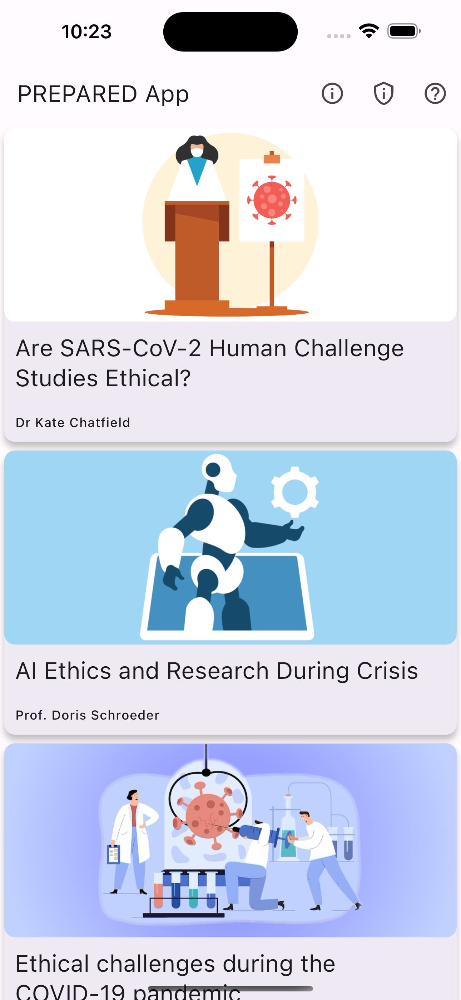
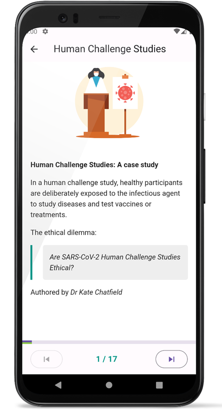

# Guidelines for developing educational content for the _PREPARED_ framework

_For instructional designers_

## Introduction

The _prepared_ framework provides the foundation for building educational mobile apps.
It derives its name from the original project that funded its inception and implementation: [PREPARED](https://prepared-project.eu).
This was used to develop the [PREPARED App](https://prepared-project.eu/app) which is a novel
approach in educating researchers, funders, publishers, and policy makers about the PREPARED CODE
that aims to accelerate research without sacrificing ethics and integrity.

This page provides _guidelines_ for instructional designers who want to develop content that is
suitable for deployment with the _prepared_ framework.

## Foundations

The primary aim of this document is to inform instructional designers about the _capabilities_ of
the framework, and to enable them to define a educational content in a way that can be easily added
to the app.

Each educational module (aka _story_) consists of some general information (like a title, authors,
and a banner image), plus a sequence of _pages_. Individual pages can be plain (i.e., containing
text, images, or video) or interactive (i.e., containing live polls, or chats).

### General information

The _general information_ describes the basic characteristics of the module. This data is used to
display a visual representation of the module in the general list, and to provide an introduction.
See for example the following screenshot showing a number of stories listed in the
[PREPARED App](https://prepared-project.eu/app).

 
Fig. 1

The minimum requirements are described in the following table:

| Parameter                | Description                                                                                                                                                                                                                    | Example                                         |
|--------------------------|--------------------------------------------------------------------------------------------------------------------------------------------------------------------------------------------------------------------------------|-------------------------------------------------|
| Title                    | The title should be a description of the case study (typically less than 50 characters long).                                                                                                                                  | Are SARS-CoV-2 Human Challenge Studies Ethical? |
| Short title              | The short title should be a succinct version of the title. This is used to present it in the list of case studies that are available in the app (typically up to 25 characters long)                                           | Human Challenge Studies                         |
| Authors                  | A list of authors (by first name and surname) that have contributed to the creation of the case study. Author names should have the preferred title, and be separated by comma. This is used to provide credit to the authors. | Dr Kate Chatfield                               |
| Banner image             | An image (as a .png or .jpg file) which is to be shown as the case study’s banner in the list of case studies. Ideal aspect ratio is 21:9. Aim for a high resolution such as 1720x720.                                         | See [fig. 1](#fig1)                             |
| Introductory information | Usually, each module starts with an introductory page. This includes the banner, a "brief description" of the topic. In the PREPARED App, this also includes the _ethical dilemma_ of the _case study.                         | See [fig. 2](#fig2)                             |

 
Fig. 2

### Pages and page types

A page is a part or stage of a module.
A typical module consists of multiple pages of different types, some of which are static and some are interactive.
Pages in the app can be accessed sequentially, by completing each page in the order defined by the case study.
Only one page is shown to the user at a time. The user can navigate forward to the next page, or backward to the previous one, using the bottom navigation bar (see [fig. 2](#fig2)).
The user can choose to return to the main screen at any time, and come back later to resume at the point where they left.

The following enumerate some of the basic _page types_ supported by the app, and defines the data required to create each one of them.
The available types are:
- **[Html content](page-html)**: This is a typical page with static content such as text and pictures, formatted similarly to how web pages are formatted using HTML.
- **Discussion**: This type simulates a chat conversation among two persons in a format similar to how this is viewed in popular chat apps.
- **Branch**: This enables branching of the flow inside a learning module, by allowing to _jump_ to a page further down in the sequence.
- **Poll**: Allows the learners to _vote_ for an option (or multiple options) by providing a number of options so that the user can pick one or more of them.
- **Video**: This page provides a means for embedding a video in the training, supporting both a portrait and a full-screen (landscape) mode.
- **Audio**: This page allows embedding an audio player for listening to short audio clips. 
